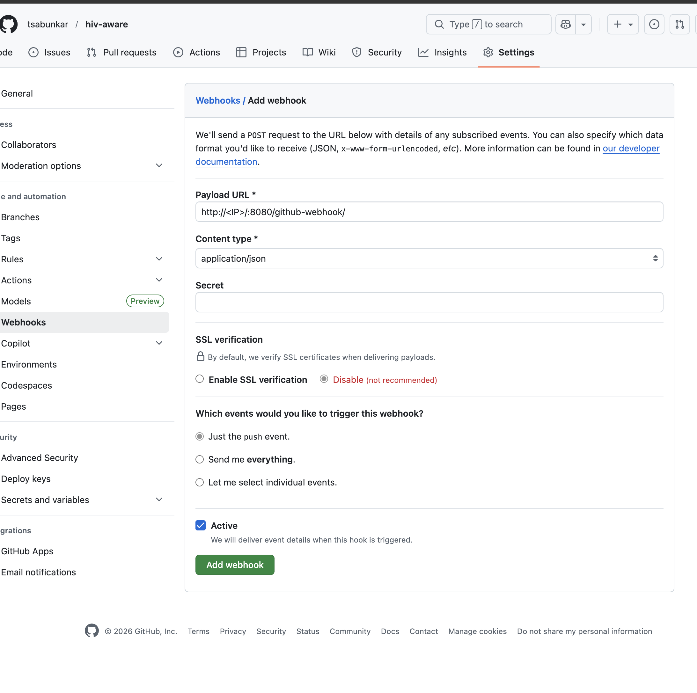

# HIV Aware — Angular Information Website

A cinematic, dark-editorial HIV information website built with Angular 17.

## Features

- **Hero Section** — Bold landing with statistics and calls to action
- **About HIV** — What HIV is, the 3 stages (Acute, Chronic, AIDS)
- **How HIV Spreads** — Myths vs facts, risk reduction tools (PrEP, PEP, U=U)
- **If You're Infected** — Step-by-step guide for newly diagnosed
- **Living With HIV** — ART medications, drug classes, healthy lifestyle
- **Footer** — Global resources (WHO, UNAIDS, CDC, AVERT)

## Design

- Dark cinematic aesthetic inspired by editorial film culture
- Playfair Display (serif) + DM Sans (body) + DM Mono fonts
- Crimson red (#c8102e) accent with teal highlights
- Animated hero with parallax background elements
- Responsive across mobile/tablet/desktop

## Getting Started

```bash
npm install
ng serve
```

Open http://localhost:4200

## Build for Production

```bash
ng build
```

Output will be in `dist/hiv-info-app/`.

## Tech Stack

- Angular 17 (Standalone Components)
- SCSS
- Google Fonts (Playfair Display, DM Sans, DM Mono)
- Pure CSS animations

## Sources

Information is based on data from WHO, UNAIDS, CDC, and AVERT.

## Infrastructure & CI/CD Setup

### Prerequisites

1. **AWS Account** with appropriate permissions
2. **AWS CLI** configured with credentials
3. **Terraform** (>= 1.5.0) installed
4. **EC2 Key Pair** created in your AWS region

### Terraform Deployment

```bash
cd terraform

# Configure variables
cp terraform.tfvars.example terraform.tfvars
# Edit terraform.tfvars with your values (bucket name, key pair, git repo URL)

# Initialize Terraform
terraform init

# Preview changes
terraform plan

# Deploy infrastructure
terraform apply -var="jenkins_key_name=your-keypair-name"

# After successful deployment, Terraform will output:
# - Jenkins URL
# - S3 bucket name
# - CloudFront URL
# - Setup instructions
```

### Jenkins Setup

1. **Access Jenkins**:

   ```bash
   # Get Jenkins URL from Terraform output
   terraform output jenkins_url
   # Example: http://34.204.181.46:8080
   ```

2. **Get Initial Admin Password**:

   ```bash
   # SSH into Jenkins instance
   ssh -i ~/path/to/your-keypair.pem ec2-user@<jenkins-public-ip>

   # Get password
   sudo cat /var/lib/jenkins/secrets/initialAdminPassword
   ```

3. **Complete Jenkins Setup**:
   - Paste the initial admin password
   - Install suggested plugins (or skip - required plugins are pre-installed)
   - Create admin user
   - Keep default Jenkins URL

4. **Verify Pipeline**:
   - Navigate to `hiv-info-app-pipeline` job
   - The pipeline is automatically configured to:
     - Pull from your Git repository
     - Run `Jenkinsfile`
     - Build Angular app
     - Deploy to S3
     - Invalidate CloudFront cache
   - Click "Build Now" to run the pipeline

### Architecture

```
┌─────────────┐      ┌──────────────┐      ┌─────────────┐
│   GitHub    │─────▶│   Jenkins    │─────▶│  S3 Bucket  │
│ (Git Repo)  │      │   EC2 + IAM  │      │   (Static)  │
└─────────────┘      └──────────────┘      └─────────────┘
                            │                       │
                            │                       ▼
                            │               ┌─────────────┐
                            └──────────────▶│ CloudFront  │
                                            │   (CDN)     │
                                            └─────────────┘
```

### CI/CD Flow

1. **Trigger**: Push to Git repository (or manual trigger)
2. **Checkout**: Jenkins pulls latest code
3. **Install**: `npm ci` installs dependencies
4. **Build**: `npm run deploy` creates production build
5. **Deploy**: Syncs `dist/` to S3 bucket
6. **Invalidate**: Clears CloudFront cache
7. **Complete**: Site is live at CloudFront URL

### Monitoring & Troubleshooting

```bash
# Check Jenkins status
ssh -i <keypair>.pem ec2-user@<jenkins-ip>
sudo systemctl status jenkins

# View Jenkins logs
sudo journalctl -u jenkins -f

# Verify AWS credentials (IAM role)
aws sts get-caller-identity

# Check S3 bucket
aws s3 ls s3://<your-bucket-name>

# Check CloudFront distribution
aws cloudfront list-distributions
```

### Cleanup

```bash
cd terraform
terraform destroy
```

## EC2 Debug Steps

- Open Jenkins page:
  - \$ http://public-ip:8080
  - \$ http://34.204.181.46:8080
- \$ terraform apply -var="jenkins_key_name=ec2-jenkins-keypair-march2026"
- \$ ssh -i ~/Downloads/ec2-jenkins-keypair-march2026.pem ec2-user@34.204.181.46
- \$ sudo systemctl status jenkins (to jenkins file work)
- \$ sudo cat /var/lib/jenkins/secrets/initialAdminPassword (copy the password)

### Step to Manual Pipeline Creation

1. Click "New Item" on Jenkins home page
2. Enter name: hiv-info-app-pipeline
3. Select "Pipeline"
4. Click OK
5. In the configuration:
   - Description: Automated CI/CD pipeline for hiv-info-app
   - Pipeline section:
     - Definition: Pipeline script from SCM
     - SCM: Git
     - Repository URL: https://github.com/tsabunkar/hiv-aware.git
     - Branch: \*/main
     - Script Path: Jenkinsfile

6. Click Save

## Webhook

- Install Required Jenkins Plugin: GitHub Integration Plugin
  - 
- Configure Job for this pipeline
  - 
- Jenkins webhook syntax:
  - \$ http://<your-jenkins-ip>:8080/github-webhook/
  - 
-
